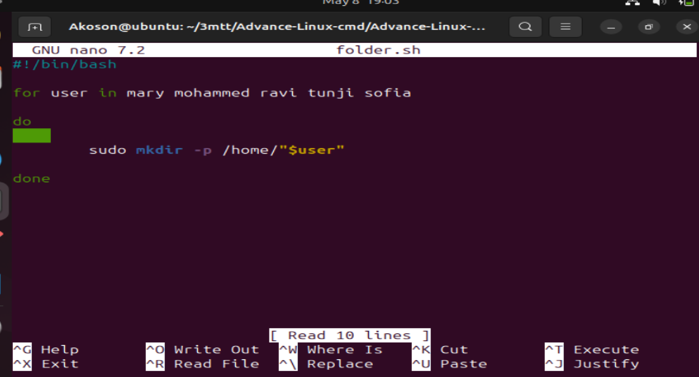

# Advance-Linux-Command

# touch command

## It creates a new empty file named script.sh in the current directory if it doesn't already exist. If the file already exists, touch simply updates its modification timestamp without changing its contents.

# ls latr command

## This command shows all files, including hidden ones, in detailed view, sorted from oldest to newest.

## running ls latr on scrpt.sh gave us an output like this "-rw-r--r-- 1 dare staff 0 Jul  6 23:38 script.sh"

## The output: 

## -rwxrwxr-x 1 Akoson Akoson 0 May  7 21:19 script.sh 

## represents the following

## -rwxr-xr-x = File type and permission string

## 1 =	Number of hard links to the file

## Akoson =	Owner (user who owns the file)

## Akoson =	Group (group that owns the file)

## 0 =	File size in bytes (0 bytes)

## May 7 21:19 = 	Last modified date and time

## script.sh =	File name

## Updating the permission so that all user classes will have execute permission using the command " chmod +x script.sh"

## chmod – command to change file permissions

## +x – means "add execute permission"

## script.sh – the target file

## Verifying the file permission using the command "ls -latr script.sh"

## The same output can be executed to achieve same result using the numbers approach 

## "chmod 755 script.sh"

# Note.txt

## We create a file using the command 

## "touch note.txt" 

## The only person that has permission to this file is the owner. To allow members and others to read, write and execute this file, we change the permission type using the command "chmod 777"

## From the output "-rwxrwxrwx 1 Akoson Akoson 0 May  8 08:57 note.txt"

## the "-" dash at the begining represent the file type and its a regular file.

# The chown command

## the chown command allow you to change the ownership of the file, directories or symbolic link to a specified username or group

## using the format:

## "chown [option] owner[:group] file(s)"

## This demostrates creation of filename.txt using touch command.

## Creating a user  using useradd command 

## Creating a group using groupadd command and 

## Changing the ownership of the file from Akoson to John

# Superuser Previledges

## Superuser privileges in Linux refer to the elevated permissions that allow a user (typically root) to perform all administrative tasks on the system. This includes installing or removing software, changing system configurations, managing users and groups, modifying critical system files, and accessing restricted areas of the file system.

## You can temporarily gain superuser privileges using the sudo command

## To switch to the root user you the command "sudo -i"

## To exit simply type "exit" to exit the shell

# User Management in Linux

## User management in Linux involves creating, modifying, and deleting user accounts and groups to control access to system resources. It ensures that each user has a unique environment, appropriate permissions, and secure access.

## Key commands include:

- adduser or useradd: Create a new user

- passwd: Set or change a user's password

- usermod: Modify user account details

- deluser or userdel: Delete a user

- groupadd, groupdel, usermod -aG: Manage user groups

# Creating a User

## Creating a user in Linux involves adding a new account to the system so that the individual can log in and access resources with specific permissions.

## This command creates a home directory, like this "/home/johndoe. 

## This is where each user created on the server will store their specific data. It also "sets default configurations, and prompts you to set a password for the new user. It also allows for entering optional user details such as full name and contact info.

## Creating users is essential for multi-user environments and maintaining secure access control.

# Granting Administrative Previledges

## By default newly created user account do not have administrative previleges. To grant administrative (superuser) privileges to a user in Linux, you typically add the user to the sudo group. Members of this group can run commands with elevated privileges using sudo.

## ussermod: This is a command that modifies user account properties.

## -a stands for append and is use to add the user to the specified group(s) without removing them from other gropus they may already belong to.

## -G stands for supplementary groups. and is followed by a comma - separated list of groups. It specifies the group to which the user should be added or modified

## In the given command: "-aG sudo" is use to add the user "johndoe" to the group.

## The sudo group is typically associated with administrative or superuser previledges. By adding "johndoe" to the "sudo" group the user gains the ability to execute commands with elevated previledges. 

# Loging out and loging back as a newly created user

# Sitching User Account

## This switches you to another user account in the same terminal session

## The - loads the new user's environment (like a full login).

## You’ll be prompted for johndoe’s password.

## After logging in, your shell will act as if you are johndoe.

# Modifting User Account

## Changing User Password

### To change a user's password in Linux, use the passwd command.

- You'll be prompted to:

- Enter your current password

- Enter your new password

- Confirm the new password

SCREENSHOT USERPW

# Creating a Group

## To create a group in Linux, use the groupadd command:

## This command creates a new group named developers.

# Adding Users to the Group

## To add a user to a group in Linux, use the usermod command with the -aG options:

## This adds the user johndoe and Godwin to the developers group without removing them from any other groups and also confirm the users have been added.

## Note that adding users to the group is done separately because usermod does not accept multiple users in one command.

# Verifying Group Membership

## Using the id command

### This shows the user ID (UID), primary group ID (GID), and all supplementary groups.

##  View members of a group:

### This will show the group name, GID, and a comma-separated list of users in the group.

## groups username command:

### Check groups for a specific user

# Deleting a User

## To delete a user in Linux, you can use the userdel command with sudo privileges:

# Side Hustle Tasl

- Create a group on the server and name it devops

- Create 5 users ['mary', 'mohammed', 'ravi', 'tunji', 'sofia'], and ensured each user belong to the devops group

- Create a folderfor each user in the /home directory. For example /home/mary

- Ensure that the group ownship of each created folder belong to devops

##  Creating a group called devops

## Creating 5 users and add them to the devops group

## Creating a folder for each user in /home (if not already created)

## Changing group ownership of each user's folder to devops

